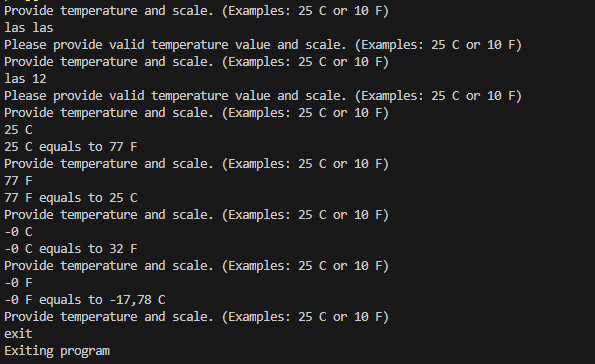

# Temperature Converter

In this task the purpose was to learn basic C# syntax by making a simple temperature converter console program. The program accepts Fahrenheit and Celcius as scale values and numbers as temperature value and converts them to opposite scale unit. If invalid user input is detected, the program prompts the user to provide valid input. User can exit the program by typing "exit".

## Technologies

C#

## Screenshots

